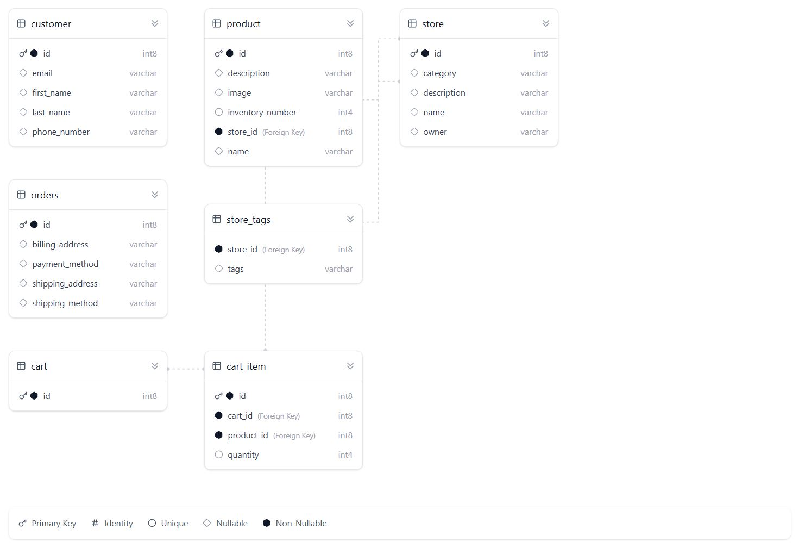

# Mini-Shopify
Mini-Shopify Project for SYSC4806 Fall 2025

## About
The **Online Shop Management System** is a web application where merchants can create and manage virtual shops, upload products, and track inventory. Customers can search for shops, browse products, and simulate purchases. The system enforces inventory constraints to prevent over-purchasing.

## Table of Contents
- [About](#about)
- [Website Link](#website-link)
- [Usage](#usage)
- [Sprints](#sprints)
- [Milestone 2 Contributions](#milestone-2-contributions)
- [Contributors](#contributors)

## Website Link
https://team28-gsdzgjcha5f5aufu.canadacentral-01.azurewebsites.net/

## Usage
### Local
To run the project locally:
### Clone the repository
git clone https://github.com/ConnorYelle/Mini-Shopify.git

### Package the application
mvn package

### Execute the jar file
cd target
java -jar Mini-Shopify-1.0-SNAPSHOT.jar

## UML Diagram
This UML diagram illustrates the main entities (Store, Product, Customer, Order) and their relationships, along with the repositories and controllers.

## Database Schema

## Sprints
- Early prototype - November 3rd, 2025
- Alpha Release - November 17, 2025
- Final demo - December 1, 2025

## Milestone 3 Contributions
### Tommy Milestone 3 Contribution
- added remove product button, so store managers can manage products better Delete 
- added Item cart repository to check if item in cart exist so you cant just delete a product if its in someones cart Delete 
- added quantity button to store page so customers can select how much they want to add to their cart Added Button for selecting Quantity of products 

### Owen Milestone 3 Contributions
- Implemented the purchase checkout page
- Fixed bug in cart and cart controller
- Added display of items to store

### Jonas Milestone 3 Contributions
- Implemented the invoice generator for an order.
- Updated tests in Order and OrderController to reflect the changes.
- Connected my invoice generator to the checkout.

### Connor Milestone 3 Contributions
- Implemented the customer and merchant homepages
- Linked buttons from the homepages to each different functionality of our website
- Added tests for both homepages

### Umniyah's Milestone 3 Contribution
- Adapted work when cart page work was duplicated by teammate; shifted focus to other integration, docs, and tests.
- Added full product editing UI (inventory & price) with Save/Cancel interactions and JSON-based update requests.
- Updated UML diagram to include Cart, CartItem, updated controller relationships, and correct domain associations.
- Updated database schema documentation to include cart and cart_item tables and relationships.
- Implemented backend product update endpoint (PUT /products/{storeId}/{productId}/update).
- Added safety logic preventing deletion of products that exist in any cart (via CartItemRepository).
- Reorganized checkout page so cart review appears before user information to improve UX.
- Added complete unit tests for Cart (add/remove/clear/total) and CartItem (quantity and pricing behaviour); implemented more backend Cart logic.

## Contributors
- [Connor Yelle 101260641](https://github.com/ConnorYelle)
- [Tommy Phang 101211316](https://github.com/tphang46)
- [Owen McKibbon 101269794](https://github.com/OwenMcKibbon1)
- [Umniyah Mohammed 101158792](https://github.com/UMNIYAH)
- [Jonas Andaya 101224271](https://github.com/jonasandaya)

